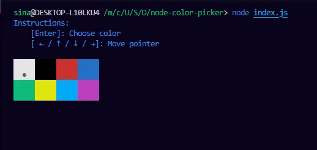

# ink-color-picker [](https://www.npmjs.com/package/ink-color-picker) [](https://npmjs.org/package/ink-color-picker) [](https://npmjs.org/package/ink-color-picker)

Color picker component built for [ink](https://www.npmjs.com/package/ink)

Please consider following this project's author, [Sina Bayandorian](https://github.com/sina-byn), and consider starring the project to show your :heart: and support.

> If you're not using Ink and need a Node.js solution, make sure to check out [node-color-picker](https://www.npmjs.com/package/node-color-picker).



## Installation

```shell
npm i ink-color-picker
```

## Usage

```tsx
// * index.tsx

import React, { useState } from 'react';
import { render, Text, Static } from 'ink';
import { ColorPicker, type Color } from 'ink-color-picker';

const App = () => {
  const [color, setColor] = useState < Color > 'white';

  const selectHandler = (c: Color) => setColor(c);

  return (
    <Box flexDirection='column' rowGap={1}>
      <ColorPicker onSelect={selectHandler} />
      <Text>Ink Color Picker Component By Sina Bayandorian</Text>
    </Box>
  );
};

render(<App />);
```

## Props

|          | Type                  | Default | Description                     |
| -------- | --------------------- | ------- | ------------------------------- |
| hint     | boolean               | True    | Whether to show the hint or not |
| onChange | `(c: Color) => void;` | ---     | Triggers on every color change  |
| onSelect | `(c: Color) => void;` | ---     | Triggers once user hits `Enter` |
